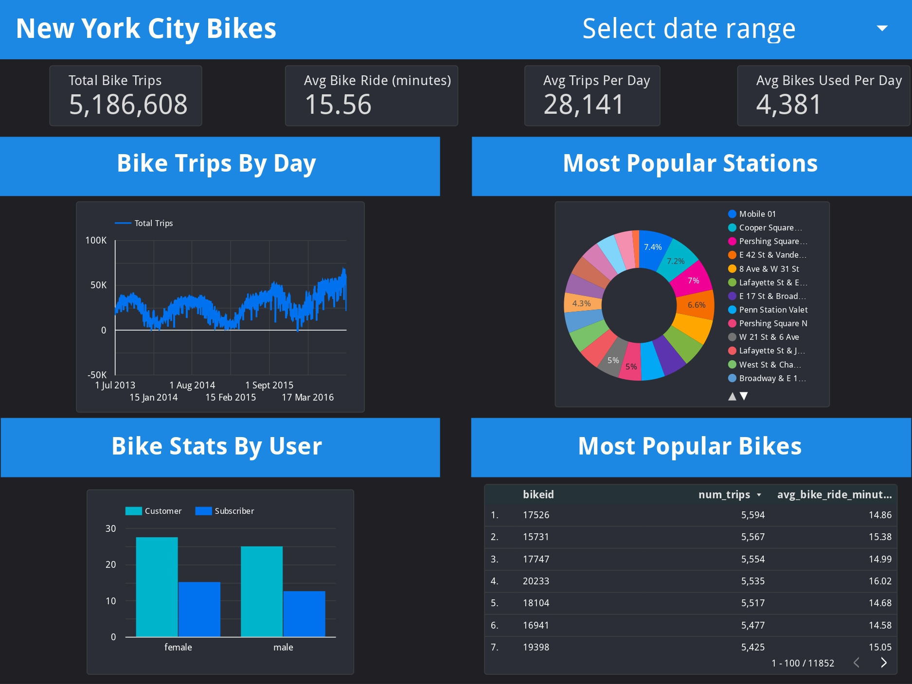

# New-York-City-Bikes-Dashboard

An interactive dashboard that displays statistics on bicycle use in New York City based on the date range selected by the user. At the top of it, you can view the total bike trips, the average bike ride in minutes, the average trips per day, and the average number of bikes used per day. In addition, you can get informed about the bike trips by day, bike stats by a user, most popular stations, and bikes. It was created with the help of Google Big Query and Data Studio tools.

Live demo: https://datastudio.google.com/reporting/302a2e50-0f91-4747-93dc-57494d96eee0/page/uRgaC
